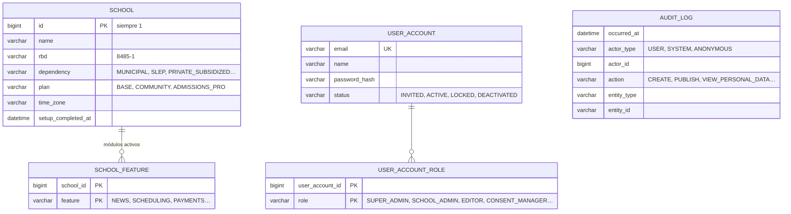
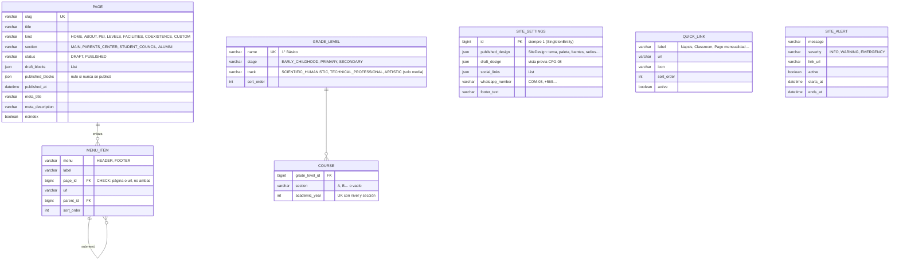
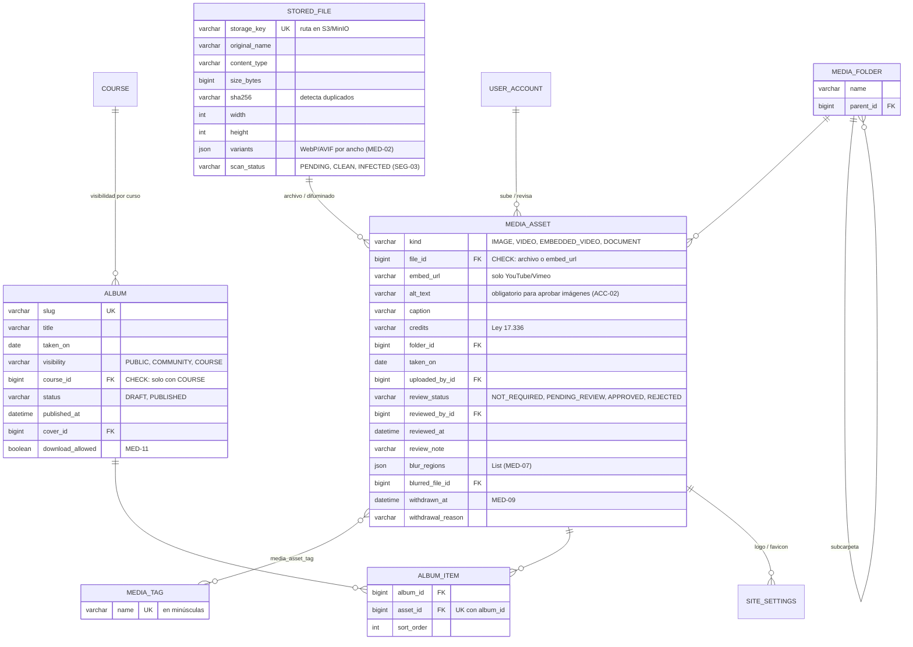
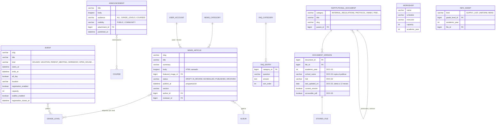
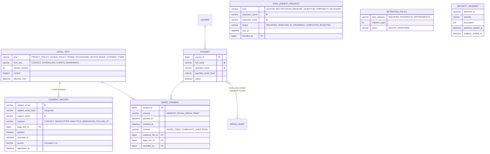
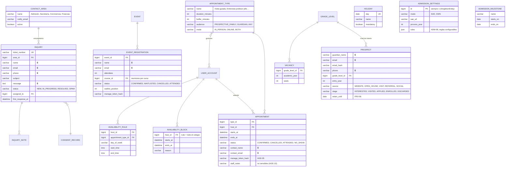

# Modelo de dominio

Diseño de entidades del MVP, agrupado por iteración de la Fase 1. Los diagramas muestran solo los campos
que definen el modelo; todas las entidades heredan además `id`, `version`, `created_at` y `updated_at`.

**Leyenda:** 🔒 indica columnas cifradas. Cada instalación atiende a un solo colegio, por eso ninguna tabla lleva columna de colegio.

---

## 1.1 Núcleo ✅

- **Una instalación = un colegio.** `SCHOOL` es el perfil del colegio dueño de la instalación: una sola fila,
  creada por el asistente de primer arranque. El dominio, la base de datos y la licencia son configuración del despliegue, no datos.
- El Super Admin del proveedor es un `USER_ACCOUNT` con rol `SUPER_ADMIN`.
- `Plan` define los módulos por defecto; los add-ons se activan aparte y sobreviven a un cambio de plan.
  En la fase 9 la licencia firmada limita qué módulos se pueden activar.
- `audit_log` es solo-inserción y guarda una copia del nombre del actor.

---

## 1.2 Sitio y estructura del colegio ✅

- **Diseño como JSON** (`SiteDesign`): tema, variante, paleta (`HexColor`), tipografías, radios, sombras y esquema de color
  en un solo `record` inmutable. Borrador y publicado se comparan con `equals`. Logo y favicon llegan en la 1.3.
- **Bloques como JSON**: `sealed interface Block` con un `record` por tipo (`Hero`, `RichText`, `QuickLinks`, `LatestNews`,
  `UpcomingEvents`, `Stats`, `Testimonials`, `CallToAction`, `Gallery`, `Timeline`, `Location`, `Faq`).
  Cada bloque se guarda con su tipo (`"type":"hero"`); agregar un bloque no exige migración, pero renombrar un tipo sí.
- Los bloques referencian medios y álbumes por id, sin llave foránea: al renderizar se ignoran los que ya no existan o estén retirados.
- Borrador y publicado separados (`draft_*` / `published_*`) permiten vista previa sin afectar el sitio (CFG-08).
- `section` + rol (`PARENTS_CENTER_EDITOR`…) restringe a los editores satélite (PUB-07).
- Una página que está en el menú no se puede borrar (llave foránea sin `ON DELETE`).
- Cada `PageKind` salvo `CUSTOM` existe a lo más una vez: lo controla el servicio de páginas (fase 3).
- `GradeLevel` y `Course` son **solo estructura** (para filtrar calendario, álbumes por curso, vacantes, reuniones).
  No hay notas, asistencia ni nada académico.

---

## 1.3 Medios ✅

- **La revisión es por foto, no por álbum.** Una misma foto se usa en álbumes, noticias y bloques; su autorización y su retiro
  valen en todos lados. Toda imagen o video nace `PENDING_REVIEW`; los documentos, `NOT_REQUIRED`.
- `MediaAsset.isDisplayable()` es **la única regla** que consulta todo lo que muestra medios: aprobado o exento, y no retirado.
- Un álbum no se publica con fotos pendientes. Una foto agregada a un álbum ya publicado queda oculta hasta que la aprueben.
- Imágenes sin personas (logo, fachada) se eximen con `exemptFromReview()`; el asistente de primer arranque lo hace con el logo.
- El difuminado guarda las zonas en fracciones (0 a 1) y una versión ya procesada (`blurred_file`), que es la que se publica.
- El EXIF se borra **antes** de guardar el archivo (MED-10): `stored_file` nunca contiene GPS.
- Un medio que está en un álbum no se puede borrar (llave foránea): el camino normal es retirarlo.
- MED-12 (nombres de estudiantes junto a fotos) se valida en el servicio, cuando exista el registro de estudiantes (1.5).

---

## 1.4 Contenido y documentos

- **Un solo `Event`** cubre calendario escolar (feriados, vacaciones), eventos con inscripción (puertas abiertas)
  y reuniones de apoderados por curso (AGE-08): cambia el `kind` y si tiene inscripción.
- `DOCUMENT_VERSION` copia nombre y RBD del colegio al publicar: la evidencia queda fija aunque el colegio cambie de nombre.
- La alerta de 12 meses (DOC-04) se calcula con `last_updated_on`; no necesita tabla.

---

## 1.5 Privacidad y consentimientos

- `LEGAL_TEXT` es inmutable una vez publicado: un cambio crea una nueva versión, y cada consentimiento apunta a la versión exacta que se aceptó (PRV-04).
- `CONSENT_RECORD` es solo-inserción. Retirar un consentimiento llena `withdrawn_at`; nunca se borra la evidencia.
- `STUDENT` es el mínimo para gestionar autorizaciones de imagen: **sin RUN** (PRV-08), nombre cifrado.
- `IMAGE_CONSENT`: una fila por autorización otorgada. Revocar llena `revoked_at`; volver a autorizar crea otra fila.
  Así queda la historia completa y la vigente es la que no tiene `revoked_at`.
- `media_asset_student` es opcional y manual (sin reconocimiento facial): permite, ante una revocación, encontrar y retirar todas las fotos del estudiante (MED-09).

---

## 1.6 Interacción

- Las visitas guiadas son `Appointment` de un tipo con audiencia `PROSPECTIVE_FAMILY`; las jornadas de puertas abiertas son `Event` con inscripción.
- Los enlaces de reprogramar/cancelar llevan un token aleatorio; en la base solo se guarda su hash.
- Evitar doble reserva: bloqueo pesimista sobre el gestor al reservar (MySQL no tiene índices únicos parciales portables).
- `HOLIDAY` se precarga por migración con los feriados chilenos de cada año.

---

## Pendiente de decidir (antes de su iteración)

- **Fase 3:** nombre y estilo de los 3 temas base.
- **1.5:** gestión de la llave de cifrado (variable de entorno vs. KMS) y su rotación.
- **1.6:** plazo legal de respuesta a solicitudes de derechos (validar con abogado; dejarlo configurable).
